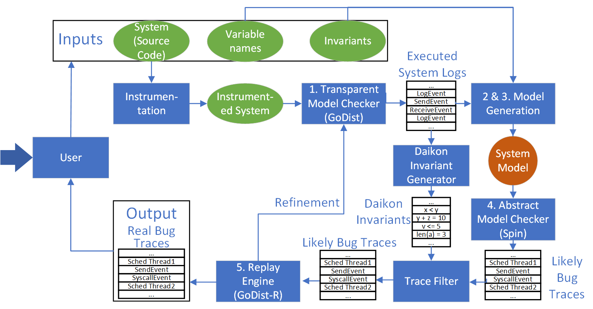

## Introduction

Dara is a hybrid model checker which combines the use of an abstract model
checker with an Implementation Level Model Checker to verify properties of
distributed systems written in Golang.

## Dara Pipeline

The Dara pipeline is highlighted in the following figure

## Overview

As shown in the pipeline, Dara is made up of multiple parts.
This section outlines what role each repository plays in the Dara pipeline.

+ [dara](https://github.com/DARA-Project/dara) : This repository implements the model inference, model refinement, and the abstract model checker parts of Dara.
+ [godist](https://github.com/DARA-Project/GoDist) : A custom modified version of Go v1.10 which provides the necessary interposition to schedule specific Go threads and capture system calls.
+ [godist-scheduler](https://github.com/DARA-Project/GoDist-Scheduler) : This repository implements the concrete state explorer and the replay engine all of which are sub-parts of our concrete model checker.

The following repositories are for specific systems we plan to use Dara on.
+ [BTCD-applications](https://github.com/DARA-Project/BTCD-Applications) : This reposiroty contains information for verifying properties in BTCD, a full node bitcoin implementation in Golang.
+ [Dara-ETCD](https://github.com/DARA-Project/Dara-Etcd) : This repository is a fork of the original ETCD repository which is a Distributed Key-Value store that uses Raft consensus algorithm.

